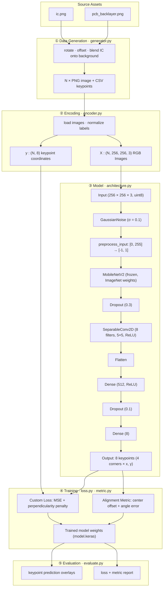

# AOI-PCB: Automated Optical Inspection for PCB Assembly

[](https://www.python.org/downloads/)
[](LICENSE)
[](https://github.com/keremaras1/aoi-pcb-v1/actions/workflows/ci.yml)

A deep learning system for detecting IC component misplacement on printed circuit boards, implementing the approach described in:

> *Automated Optical Inspection for Printed Circuit Board Assembly Manufacturing with Transfer Learning and Synthetic Data Generation* — Saif, Aras & Giuseppi, MED 2022 — [IEEE Xplore](https://ieeexplore.ieee.org/document/9837280)

## Overview

Automated Optical Inspection is one of the most common and effective quality checks in PCB assembly manufacturing, but deploying deep learning solutions in this space is typically bottlenecked by two practical constraints: the sheer number and variety of PCB components, each with intricate and design-specific geometry, makes assembling large labelled training datasets for specific board configurations costly and time-consuming, while the computing resources available in typical industrial settings are often severely limited.

This project is a proof of concept demonstrating that both constraints can be addressed together. By combining **synthetic data generation** with **transfer learning from a pretrained backbone**, a reliable starting point for IC keypoint detection can be reached without collecting a single hand-labelled real image — and the resulting model is compact enough to run on low-cost edge hardware.

The problem is framed as a **keypoint regression task**: given a PCB image, predict the (x, y) coordinates of all four corners of the IC bounding box. Three design choices make this viable:

- **Synthetic training data** — A reference IC is blended onto real PCB background images with randomised rotation and positional offset, generating a representative dataset programmatically. No hand-labelling required.
- **Frozen MobileNetV2 backbone** — Pre-trained ImageNet features are reused as-is via transfer learning. Only the lightweight regression head is trained, keeping compute requirements low and making the model suitable for deployment on constrained hardware.
- **Custom perpendicularity loss** — In addition to coordinate MSE, a penalty term enforces that the four predicted corners form right angles, encouraging geometrically valid outputs rather than just minimising per-point error.

## Pipeline



## Results

Training stabilises around epoch 600. On the validation set:

- Combined loss: ~0.0001
- Center position MAE: ~0.01 (normalised coordinates)
- The model reliably detects the IC footprint within the tolerance required for assembly inspection.

## Installation

Requires Python ≥ 3.10 and TensorFlow 2.18.

```bash
git clone https://github.com/keremaras1/aoi-pcb-v1.git
cd aoi-pcb-v1

# CPU only
pip install -e ".[dev]"

# Apple Silicon GPU (tensorflow-metal)
pip install -e ".[dev,metal]"

# Linux / WSL2 CUDA GPU
pip install -e ".[dev,cuda]"

# With notebook dependencies (matplotlib, jupyterlab)
pip install -e ".[dev,notebooks]"
```

## Usage

### 1. Generate the dataset

```bash
python scripts/generate_dataset.py
# or with a custom config:
python scripts/generate_dataset.py --config path/to/config.json
```

Creates `datasets/training/` and `datasets/validation/` with PNG images and CSV label files.

### 2. Train

```bash
python scripts/train.py
# or with a custom config and output directory:
python scripts/train.py --config path/to/config.json --output-dir experiments/my_run
```

Each run saves `model.keras`, a training log CSV, and a `config.json` snapshot to a timestamped directory under `experiments/`.

### 3. Evaluate

```bash
# Auto-detect the most recently modified run
python scripts/evaluate.py

# Evaluate a specific run
python scripts/evaluate.py --model-path experiments/run_YYYYMMDD_HHMMSS/model.keras

# Save prediction overlay images
python scripts/evaluate.py --save-visuals --n-visuals 20
```

### Notebooks

Interactive walkthroughs are in `notebooks/`:
- `training.ipynb` — data generation → model architecture → training loop → loss curves
- `evaluation.ipynb` — load model → run predictions → visualise keypoint overlays → per-sample error histogram

## Configuration

All parameters live in `config.json`:

| Section     | Key parameters                                                                     |
|-------------|------------------------------------------------------------------------------------|
| `generator` | `dataset_size`, `rotation_angle`, `delta`, `seed`, output dirs, source image paths |
| `encoder`   | `normalize_data`, `normalize_labels`, `train_data_splice`                          |
| `training`  | `optimizer_lr`, `n_epochs`, `early_stopping.*`, `lr_schedule.*`                    |
| `metrics`   | `x_weight`, `y_weight`, `angle_weight`                                             |

## Testing

```bash
pytest tests/
```

The test suite covers the config loader, data utilities, the full synthetic generation pipeline, encoder (including error branches), model architecture, custom loss, and alignment metric — with 100% statement coverage across all source modules. Tests are fully hermetic: no real PCB images or pre-generated datasets required.

## Project Structure

```
aoi-pcb-v1/
├── config.json
├── pyproject.toml
├── LICENSE
├── pcb_images/              # Reference images for synthesis
├── datasets/                # Generated data (gitignored — run generate_dataset.py)
├── experiments/             # Training runs  (gitignored — run train.py)
├── src/aoi_pcb/
│   ├── config_loader.py
│   ├── data/
│   │   ├── generator.py
│   │   ├── encoder.py
│   │   └── utils.py
│   └── model/
│       ├── architecture.py
│       ├── loss.py
│       └── metric.py
├── scripts/
│   ├── generate_dataset.py
│   ├── train.py
│   └── evaluate.py
├── notebooks/
│   ├── training.ipynb
│   └── evaluation.ipynb
└── tests/
```

## Citation

```bibtex
@INPROCEEDINGS{9837280,
  author={Saif, Syed Saad and Aras, Kerem and Giuseppi, Alessandro},
  booktitle={2022 30th Mediterranean Conference on Control and Automation (MED)},
  title={Automated Optical Inspection for Printed Circuit Board Assembly Manufacturing
         with Transfer Learning and Synthetic Data Generation},
  year={2022},
  pages={318-323},
  doi={10.1109/MED54222.2022.9837280}
}
```
